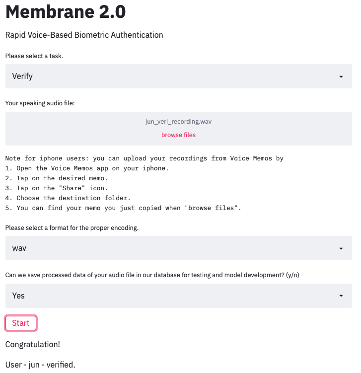
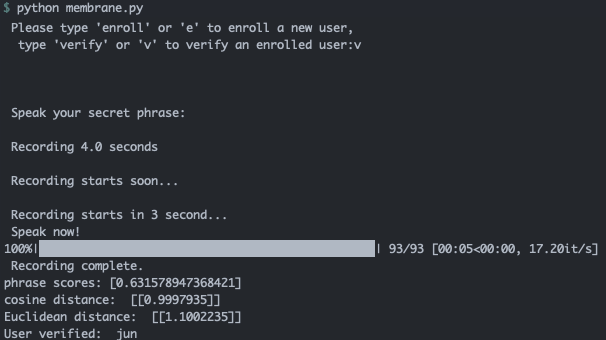

# Membrane 2.0
Rapid Voice-Based Biometric Authentication Project with OMIC


We have a web-based biomedical/AI platform used for open-source COVID-19 research. Users currently log in via magic link, but we would like to add an option where the person is identified via voice through the browser. Ideally we would generate a phrase for the user to speak into a laptop/PC microphone, at which time the user would be rapidly authenticated and would be granted access.

**Contributor**: [Jun Seok Lee](lee.junseok39@gmail.com).

***jun* branch is the default public branch. *master* will not be updated until the project becomes public**

**Deployed testing environment**:  http://membrane.insightai.me/:




<!-- ## TODO

- [x] Jun registers for [OS](os.omic.ai).
- [x] Jun signs Nondisclosure Agreement.
- [x] Profiling visualization dataset created -- 200 samples.
- [x] Training visualization dataset created -- 1K+ samples. -->

## Background
- https://github.com/CorentinJ/Real-Time-Voice-Cloning
- https://github.com/mozilla/DeepSpeech
- https://github.com/Janghyun1230/Speaker_Verification
- https://github.com/Dheeraj2444/speaker-identification
- https://github.com/wq2012/awesome-diarization
- https://voiceit.io/
- https://github.com/resemble-ai/Resemblyzer
- https://github.com/timsainb/noisereduce


## Data

There are a plethora of voice identification and transcription datasets publicly available, including FSDD, VoxCeleb, CommonVoice, LibreSpeech, etc.  These existing datasets will require transfer learning and need to (optimistically) go through various real-world transformations to match production environments, which primarily include non-linear speech cadence/stuttering/filler words and static/dynamic environment background noise.  In total, the datasets accumulate to over 2TB.

### VGGVox
- An audio-visual dataset consisting of short clips (\~5s) of human speech, extracted from interview videos uploaded to YouTube

[VoxCeleb1](http://www.robots.ox.ac.uk/~vgg/data/voxceleb/vox1.html) - 1251 speakers, 153,516 utterances, ~ 45 GB

[VoxCeleb2](http://www.robots.ox.ac.uk/~vgg/data/voxceleb/vox2.html) - 6,112 speakers, 1,128,246 utterances, ~ 65 GB

http://www.robots.ox.ac.uk/~vgg/data/voxceleb/vox1a/vox1_dev_wav_partaa
http://www.robots.ox.ac.uk/~vgg/data/voxceleb/vox1a/vox2_dev_aac_partah

```
wget --user=XX --password=YY http://www.robots.ox.ac.uk/~vgg/data/voxceleb/vox1a/vox1_dev_wav_partaa
```

for
```
/vox1_dev_wav_partaa
...
/vox1_dev_wav_partah
/vox1_test_wav.zip
```
```
/vox2_dev_aac_partaa
...
/vox2_dev_aac_partah
/vox2_test_aac.zip
```

### Privacy

The data provided for the development of this model is highly protected; access to this data is permissable only by the signing of our Nondisclosure Agreement and under no condition can be distributed outside of Omic, Inc.

Software developed on top of this data, however, are openly shareable, so long as they do not immediately pose a risk of the above data policy.

*tl;dr don't share data and be mindful with sharing how you interface with the data.*

## Structure

```model/toy_modelv1/``` : Path for the first version toy-model.

```model/modelv2/``` : Main Membrane 2.0 model.

- *Final stage files will not be updated until the project becomes public*

- *Final weights for modelv2 (VBBA, Membrane) will not be available until the project becomes public*
<!-- ```src/``` : OS deployment files. Will not be updated except initial raw files. -->


## Model

We would like a voiceprint authentication model that isolates the user's voice based on the prescribed phrase and then authenticates the user based on a voice match to the training phrase.


As an example, we could provide several training phrases for the user to speak in our application through the laptop microphone. We would record these phrases, then provide a new login phrase for them to read and log in. The person’s voice would need to be isolated from background noise.


The model would score the new login phrase - identifying the person of closest match and false positive/negative (precision/recall) data for understanding false positive and negative rates. The goal would be for these to score at least as well as common voice recognition models that currently exist.

While final weights will not be available until the project becomes public here I am providing intermediate weights of models for model testing:

```toy_modelv1```: [Download](https://membrane.s3-us-west-2.amazonaws.com/checkpoints/weights.h5) to ```model/toy_modelv1/data/weights/```

```modelv2```: [Download](https://membrane.s3-us-west-2.amazonaws.com/checkpoints/checkpoint_20200617-015735_0.0005641535972245038.pth.tar) to ```model/modelv2/checkpoints/```
<!-- Weights location:  https://membrane.s3-us-west-2.amazonaws.com/checkpoints/checkpoint_20200622-102649_0.00017134382505901158.pth.tar -->

<!-- - *Final weights will not be available until the project becomes public* -->

[Tier 1 - Toy Model](#Tier-1---Toy-Model)

[Tier 2 - VBBA](#Tier-2---VBBA)

[Tier 3 - Membrane](#Tier-3---Membrane)

Note: If run into an audio library/dependency error while running the model, please also follow [Dependencies](#Dependencies).

---------------------------------------

### Tier 1 - Toy Model
```model/toy_modelv1/```

Pre-trained model by VoxCeleb1 dataset.

* Install python3.7.7 and the required packages, i.e.
```
conda create -n membrane_toy python=3.7.7 pip
python -m pip install -r requirements.txt
```
* To run:
```
python3 verification.py verify --input [input file] --test [test file] --metric [metric function (default:'cosine')] --threshold [threshold of metric function for verification (default:0.1)]
```
An example:
```
python3 verification.py verify --input data/enroll/19-enroll.wav --test data/test/19.wav --metric 'cosine' --threshold 0.1
```
* Results will be stored in `res/results.csv`. Each line has format: `[input file name], [test file name], [metric function], [distance], [threshold], [verified?]`

---------------------------------------

### Tier 2 - VBBA
```model/modelv2/```

Voice-Based Biometric Authetication.

Repurposed Voice Verification Model Based on Toy Model (Pre-trained VGGVox1).

* Install python3.7.7 and the required packages
```
conda create -n membrane python=3.7.7 pip
python -m pip install -r requirements.txt
```
* Extract training data into `/wav_train_subset`
* Move some subset of data of test users into `/wav_test_subset`
* To run:
```
python3 VBBA.py (optional argument)
```


```
(optional arguments):
  -h, --help            show this help message and exit
  -l, --list-current-users
                        Show current enrolled users
  -e, --enroll          Enroll a new user
  -v, --verify          Verify a user from the ones in the database
  -i, --identify        Identify a user
  -d, --delete          Delete user from database
  -c, --clear           Clear Database
  -u, --username        USERNAME
  -f, --with-file       Provide a recording file rather than record
```
* Results will be stored in `speaker_models.pkl`.
* More details in `model/modelv2/README.md`.


---------------------------------------

### Tier 3 - Membrane
**Command Line Model**

```model/modelv2/```

Speech-to-Text Identification and Voice-Based Biometric Authentication with Streaming Audio

* Install python3.7.7 and the required packages
```
conda create -n membrane python=3.7.7 pip
python -m pip install -r requirements.txt
```
* For hyperparameters and global constants, check `utils.py`
* Download model weights to

```model/modelv2/checkpoints/```: [Download](https://membrane.s3-us-west-2.amazonaws.com/checkpoints/checkpoint_20200617-015735_0.0005641535972245038.pth.tar)

```model/modelv2/deepspeech_data/```: [Download1](https://github.com/mozilla/DeepSpeech/releases/download/v0.7.4/deepspeech-0.7.4-models.pbmm), [Download2](https://github.com/mozilla/DeepSpeech/releases/download/v0.7.4/deepspeech-0.7.4-models.scorer) (please download both)


<!-- * Extract training data into `/datasets/` -->
* To run:


```
python3 membrane.py
```
Instructions follow on user's terminal, i.e.
--*`"Please type 'enroll' or 'e' to enroll a new user, type 'verify' or 'v' to verify an enrolled user:"`*


<!-- --------------------------------------- -->

- **Public mode** (shown in the terminal instructions):

```
enroll or e
```

: Enroll a user (command line input follows) -- *`"Please type your username:"`*

```
verify or v
```

: Verify a user

<!-- --------------------------------------- -->

- **Administrator mode** (not shown in the terminal instructions):

```
delete or d
```

: Delete a user (command line input follows) -- *`"Please type username to delete:"`*

```
clear or c
```

: Clear all users

```
file or f
```

: Use an existing file instead of the streaming recorder (command line input follows) -- *`'Please input file path:'`*

<!-- --------------------------------------- -->


* Results will be stored in `speaker_models.pkl` and `speaker_phrases.pkl`.
* More details in `model/modelv2/README.md`.


<!-- ---------------------------------------

**OS Deployment**


--------------------------------------- -->

<!-- ### Tier 4 (Boss Level)

Collect and package all references and results.  Publish a paper in a top journal.  Save the princess. -->

---------------------------------------
---------------------------------------
### Dependencies

If run into an audio library/dependency error, please try this (Linux):
```
apt-get update && \
	apt-get install -qq -y gcc make \
apt-transport-https ca-certificates build-essential \
libasound-dev portaudio19-dev libportaudio2 libportaudiocpp0 libav-tools alsa-utils
```
